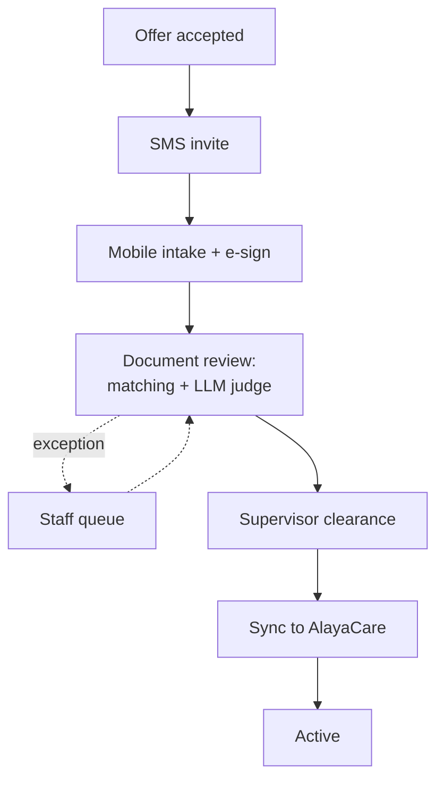
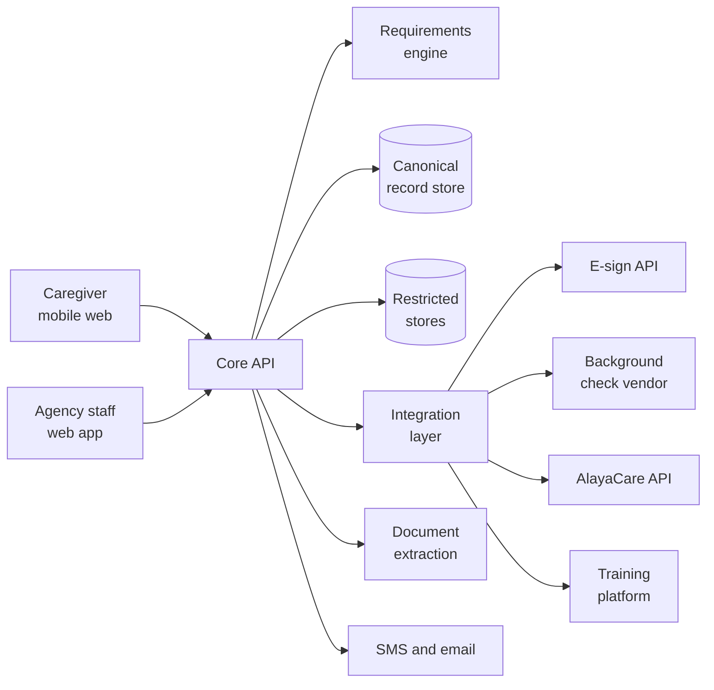

# Credora PRD: Caregiver Onboarding & Credential Tracking

## Overview and problem

Credora is a credential tracking and onboarding platform for home care agencies. It takes a caregiver from accepted offer to cleared-to-work with no manual re-keying and far less manual document review.

Today, onboarding at an agency like Alvita Care runs on a 29-document DocuSign packet, photos of IDs and certificates sent by text or email, spreadsheets, Zendesk tickets, and manual entry into AlayaCare. Staff spend about 2 hours per caregiver on this work, roughly $40 in labor at $20 per hour. With caregiver turnover commonly cited at 60 to 80% a year, that cost repeats constantly.

Labor is the floor, not the whole cost. Every day a caregiver waits in the queue is unstaffed billable hours, every applicant who abandons a desktop PDF packet wastes recruiting spend, and every missed expiry (TB, certification, in-service hours) is audit and billing risk.

General HR platforms such as Rippling cover the generic forms (W-4, I-9, direct deposit) but not the home care layer: state health department fingerprint checks, care certifications, health screening, vaccination consents, in-service training hours, home care pay terms, and write-back into agency platforms like AlayaCare that each agency has configured differently.

## Goals and non-goals

V1 succeeds if an agency can onboard a caregiver end to end without staff re-typing any data, and can see at any moment who is cleared to work and who is about to lapse.

**Goals**

- Replace the DocuSign packet, spreadsheet, and Zendesk tracking with one caregiver record captured once.
- Cut staff time per caregiver from about 2 hours to under 20 minutes, spent mostly on exceptions.
- Shorten days from accepted offer to cleared-to-work.
- Reduce applicant drop-off during paperwork with a phone-first flow.
- Automate the review staff do today: checking identity details match across documents, and judging whether home-care records are valid.
- Sync cleared caregiver data, including credential expiry dates, into AlayaCare automatically, mapped to each agency's configuration.

**Non-goals for V1**

- Scheduling, shift assignment, or caregiver-client matching.
- Recruiting, job posting, or applicant tracking before the offer.
- Building a training platform or training content. Training requires clinical approval from the director of nursing; we only track completed hours.
- Continuous compliance monitoring and renewal alerts after hire (see Future ideas).
- Sharing caregiver records across agencies (see Future ideas).
- Payroll processing. We capture payroll inputs and pass them on.
- Replacing the background check vendor. We integrate with it.
- Languages other than English, native mobile apps, and states other than New York.

## Users and roles

Five roles, each with the least access its job requires.

| Role | Who | What they do | Access |
| --- | --- | --- | --- |
| Caregiver | New hire, on a phone | Completes intake, signs, uploads documents, sees what is missing | Own record only |
| Onboarding coordinator | Agency HR or office staff | Sends invites, works the exception queue, chases missing items | All caregivers, no restricted data |
| Clinical supervisor | Director of nursing or equivalent | Reviews the clearance checklist and signs off | Clearance view, medical results needed for clearance |
| Agency admin | Owner or ops manager | Configures requirements, integrations, and users | Configuration and reports |
| Implementation staff | Our forward-deployed team | Sets up rules, form templates, and AlayaCare field mapping per agency | Configuration only, audited |

Third parties such as references, clinics, and the background check vendor interact through links or integrations, not accounts.

## V1 scope decisions

V1 covers onboarding and credential verification at hire for private-duty agencies in New York, starting with Alvita Care.

| Decision | V1 choice | Why |
| --- | --- | --- |
| Product scope | Onboarding + credential verification at hire | Onboarding is continuous due to turnover; ongoing monitoring after hire is a later phase |
| States | New York only | Alvita's primary market; one state's rules keeps V1 small; Connecticut follows |
| System of record sync | Automatic sync to AlayaCare via API | Removes the final re-keying step; depends on API access (see Risks) |
| Caregiver interface | Mobile web, no app install | Caregivers apply on phones; an install step adds drop-off |
| Signatures | Integrate an e-sign API (DocuSign or Dropbox Sign) | Legally tested signatures and audit trails without building them |
| Document review | Automatic extraction, rule-based cross-document matching, and an LLM judge for home-care record validity, with a staff queue for exceptions | Replaces today's manual copying and discretionary review; uncertain cases still reach staff |
| Language | English only | Keeps V1 small; the form engine should not hard-code strings |

Pricing and pilot timing are out of scope for this draft.

## Target workflow

The caregiver moves through one tracked pipeline from accepted offer to active in AlayaCare.

The pipeline replaces each manual step at Alvita today.

| Stage | Today at Alvita | With Credora |
| --- | --- | --- |
| Hand-off | Coordinator opens a Zendesk ticket | Offer triggers an SMS invite and a tracked record |
| Paperwork | 29-document DocuSign packet; SSN and name retyped repeatedly | One mobile flow; each field entered once; forms generated and sent for e-signature |
| Documents | Photos of IDs and certificates sent by text or email | In-flow upload with automatic extraction |
| Review | Staff copy details such as name and DOB from IDs into spreadsheets, Zendesk, and AlayaCare, check they match across license, passport, and other documents, and judge at their discretion whether home-care records are valid | Rule-based matching across documents; an LLM judge checks each home-care record is unexpired and from a legitimate issuer; staff handle exceptions |
| Verification | Background check likely via a vendor; references chased by phone and fax | Vendor integration and automated reference requests |
| Training | Completion tracked on Alvita's internal training platform | Hours ingested and checked against state minimums |
| Sign-off | Supervisor reviews items spread across several places | One clearance view with every requirement and its status |
| Activation | Data copied from PDFs to spreadsheets to AlayaCare | Automatic sync to the agency's AlayaCare configuration, including expiry dates |

## Functional requirements

V1 has nine modules. Requirements marked P0 block the Alvita launch; P1 can follow shortly after.

### 1. Caregiver intake (P0)

- Invite by SMS link; verify phone by one-time code and email by link.
- Save and resume at any point; show a progress bar and a list of what is still missing.
- Validate as the caregiver types: SSN and phone format, DOB range, address normalization, required fields.
- Capture each field once and reuse it on every form that needs it.
- Support repeating blocks: employment history (up to 5), education (up to 3), references (minimum 2), emergency contacts (up to 2).
- Capture the home-care profile: certifications held (PCA, HHA, CNA), care-setting experience and years, clinical skills checklist, shift types, willing-to-work locations, pet and smoker tolerance, languages, driver's license and vehicle, COVID status.
- Show only the sections required by the caregiver's state and role.

### 2. Form generation and e-signature (P0)

- A document-set engine selects the required documents by state, service type, and agency policy.
- Generate filled official forms from the caregiver record: W-4, NY IT-2104, I-9 Section 1, DOH CHRC-102 and the fingerprint questionnaire, NY wage notice, direct deposit election.
- Generate agency documents (application, offer letter, job description, worker agreement) from templates.
- Treat the roughly 12 attestation-only documents as sign-only, with no data entry.
- Send all documents in one e-signature envelope; store signed copies with template version and timestamp.

### 3. Document capture and review (P0)

- Upload by phone camera with guidance on glare and cropping.
- Extract name, DOB, document number, issuer, and issue and expiry dates from IDs, certificates, and clinic results.
- **Identity matching (rule-based):** confirm name, DOB, and ID numbers agree across the driver's license, passport, SSN card, other documents, and intake data. Tolerate formatting differences, middle names, and documented name changes; route real mismatches to staff.
- **Home-care record validity (LLM judge):** for certifications (HHA, PCA, CNA), TB and physical results, immunization records, and CPR or training certificates, judge whether the record is unexpired, has plausible dates, matches the requirement it is meant to satisfy, and comes from a legitimate issuer such as a recognized training program, licensed clinic, or state agency. Staff make this call at their discretion today.
- The judge returns a verdict, a confidence level, and reasons tied to what it read on the document, so staff can see why.
- Check issuers against an agency-maintained list of accepted programs and clinics where one exists.
- Auto-accept only when extraction, identity matching, and the judge all pass; everything else goes to the staff queue with the judge's reasoning attached.
- Log every judge decision with inputs, output, and model version, and have staff review a sample of auto-accepted records each week.
- Keep the steps the law assigns to a person with staff: I-9 Section 2 document examination, and certification lookup in the NY Home Care Registry unless an approved automated method exists.

### 4. Requirements engine (P0)

- Each requirement has a type (form, document, check, training, attestation), accepted evidence, validity period, renewal rule, and whether it blocks clearance.
- Requirements are assembled from layered templates: state, then service type, then payer, then agency policy.
- Agency admins and implementation staff can edit templates without code.

### 5. Verification workflows (P0)

- Criminal history: track the DOH fingerprint process from submission to result, as a coordinator task where no integration exists.
- Background check: integrate with the agency's existing vendor; pull status and result.
- References: send each reference a short web form by email or SMS, log attempts, escalate after two misses.
- Health screening: track physical exam, TB screening (test or chest X-ray), and immunizations as structured requirements with result and date.
- Vaccination consents: Hep B consent or declination, flu declination with reason, COVID status.

### 6. Training hours tracking (P1)

- Import orientation and in-service hours from the agency's training platform by API or scheduled file.
- Compare hours against state annual minimums and flag shortfalls.

### 7. Clearance and sign-off (P0)

- One screen per caregiver showing every requirement, its evidence, and status.
- Supervisor signs off when all blocking items are met; the sign-off is logged with identity and time.
- Clearance triggers the AlayaCare sync.

### 8. AlayaCare sync (P0)

- A per-agency mapping from our canonical record to that agency's AlayaCare fields, including custom fields.
- Create and update caregiver profiles, credentials with expiry dates, and attached documents.
- Idempotent writes, retries, a sync log, and a preview of changes before the first sync for each agency.
- Surface conflicts when AlayaCare data differs from ours instead of overwriting silently.

### 9. Coordinator dashboard (P0)

- Pipeline view by stage with days in stage and current blocker, replacing Zendesk tracking.
- Exception queue showing each flagged document, what failed, and the judge's reasoning.
- Record every credential's issuer and expiry date at activation and sync it to AlayaCare. Monitoring those dates after hire is out of V1 scope.

## Data model

One canonical caregiver record feeds every form, check, and sync; about 100 unique fields replace the repeated entries across the 29-document packet.

| Group | Key fields | Storage tier |
| --- | --- | --- |
| Identity | Legal name, other names, DOB, SSN, gender, marital status, country of birth, CHRC physical descriptors | Sensitive (SSN encrypted separately) |
| Contact | Address, phones, email, preferred language, SMS consent | Standard |
| Government IDs | Driver's license and state, work authorization document type, number, and expiry | Sensitive |
| Home-care profile | Certifications, care-setting experience, clinical skills, shift types, locations, pet and smoker tolerance, languages, vehicle | Standard |
| History | Employment, education, references, emergency contacts | Standard |
| Credentials | Type, number, issuer, issue date, expiry, evidence file, verification status | Standard |
| Screening results | Background check, CHRC, registry checks | Sensitive |
| Payroll inputs | Pay rates, W-4 and IT-2104 elections, bank routing and account number | Sensitive (bank data encrypted separately) |
| Signed documents | Template, version, envelope ID, signed PDF, timestamp | Standard |

Two groups live in separate, restricted stores:

- **Medical:** the medical history questionnaire, physical capability answers, and health screening details. Kept apart from the personnel file; only the pass or fail status needed for clearance is visible outside it.
- **EEOC self-identification:** gender and race or ethnicity from the voluntary form. Never shown to coordinators or supervisors, never synced to AlayaCare, used only for aggregate reporting.

Every requirement instance links a caregiver, a requirement template, its evidence, a status, and an expiry date, which is what drives clearance and tracking.

## Security, privacy, and regulatory requirements

Credora holds SSNs, bank accounts, immigration documents, and medical answers, so security is a launch requirement, not a later phase.

**Security**

- Encryption in transit and at rest; field-level encryption for SSN, bank account numbers, and work authorization numbers.
- Role-based access as defined in Users and roles; sensitive fields masked by default and revealed only with a logged reason.
- Audit log of every view, edit, export, and sign-off on a caregiver record.
- Single sign-on or enforced multi-factor authentication for agency users.
- Hosting on a cloud provider that will sign a business associate agreement; SOC 2 readiness as a near-term target. Any LLM provider used for document review must offer zero data retention and sign a BAA; send it only the fields it needs.

**Privacy and retention**

- Collect only what the agency's configured requirements need.
- Retention rules per document type, including I-9 retention and deletion of data for applicants who never start.
- Caregivers can see their own record and what the agency holds.

**Regulatory**

- Electronic I-9: meet federal rules for electronic signatures, storage, and audit trails; remote document examination only through an approved procedure.
- E-signatures: rely on the e-sign provider's compliance with federal and state electronic signature laws.
- Background checks: FCRA disclosure and consent as a standalone document before any check runs.
- Medical and EEOC data: separation as described in the Data model.
- HIPAA: sign a BAA with each agency where the platform handles client-related information such as the PHI acknowledgement workflow.

All of the above needs review by counsel before real caregiver data is stored.

## Technical architecture

A single web application with a rules-driven core and an integration layer; the stack choices below are proposals for review.

The core API owns the record and requirements; every external system sits behind the integration layer so a new platform (WellSky, AxisCare) is a new connector, not a rewrite.

| Component | Proposed approach |
| --- | --- |
| Caregiver and staff apps | One responsive web app (for example, Next.js); caregiver flow built phone-first |
| Core API and database | Relational database (for example, Postgres) with separate encrypted stores for medical and EEOC data |
| Requirements engine | Declarative templates stored as data, layered by state, service type, payer, and agency |
| Form generation | Fill official PDF forms from the record, then send through the e-sign API |
| Document extraction | A managed OCR service for extraction, rule-based identity matching across documents, and an LLM judge for home-care record validity |
| Integration layer | Per-agency field mapping stored as configuration; a job queue for syncs with retries and logs |
| Messaging | An SMS and email provider for invites, one-time codes, reminders, and reference requests |
| Hosting | A cloud provider that signs a BAA; secrets managed centrally; backups encrypted |

The per-agency AlayaCare mapping is the component most likely to differ between customers, so it must be configurable by implementation staff without a deploy.

## Success metrics

Measure against Alvita's current baseline, which we still need to collect.

| Metric | Baseline today | V1 target |
| --- | --- | --- |
| Staff time per caregiver onboarded | About 2 hours | Under 20 minutes |
| Days from accepted offer to cleared-to-work | To collect | Cut by half |
| Applicants who start paperwork but never finish | To collect | Cut by half |
| Fields re-typed by staff per caregiver | Every field, several times | Zero |
| Uploads auto-accepted without staff review | 0% | 70% or more |
| Auto-accepted records later found invalid in weekly sampling | Not measured today | Under 1% |
| AlayaCare syncs completed without manual fixes | Not applicable | 95% or more |

The targets are placeholders until the baseline is measured on real Alvita hires.

## Risks and open questions

The biggest risk is whether AlayaCare's API allows reading and writing the custom fields each agency relies on.

| Risk | Impact | Mitigation |
| --- | --- | --- |
| AlayaCare API does not expose custom fields, or access requires a partnership | Automatic sync fails, the core promise weakens | Confirm access first; fall back to a structured export for manual import |
| Per-agency mapping takes too long | We become a services business | Track setup hours per agency; build a library of common mappings |
| LLM judge accepts an invalid or fraudulent record | Audit exposure for the agency | Judge shows its reasoning; conservative thresholds; registry checks; staff queue for anything uncertain; weekly sampling of auto-accepted records |
| Sensitive data breach | Severe legal and trust damage | Security requirements above, counsel review, and a limited data footprint |
| Code from Alvita is reused | Ownership dispute | Clarify who owns the existing training platform and AlayaCare tool before reuse |
| Rules change by state | Compliance gaps | Requirement templates versioned and reviewed per state |

**Open questions**

- [ ] Does AlayaCare's API support reading and writing custom fields and documents, and what access is needed?
- [ ] Which background check vendor does Alvita use, and does it have an API?
- [ ] Where do TB, physical, and immunization results come back today, and in what format?
- [ ] Does Alvita keep a list of accepted training programs and clinics the judge can check issuers against?
- [ ] What is in the Home Care Worker Agreement (023A), and does it need data fields?
- [ ] Can certification lookups in the NY Home Care Registry be automated?
- [ ] Does Alvita use E-Verify, which affects remote I-9 document examination?
- [ ] What are Alvita's hires per year, days to first shift, and paperwork drop-off rate?
- [ ] Which service types and payers does Alvita serve, and do any add requirements?
- [ ] Who owns the code Sreyas built at Alvita?

## Future ideas

These ideas are deliberately left out of V1 because of their complexity.

- **Continuous compliance monitoring:** watch every credential after hire, remind caregivers before expiry, alert staff, and push status changes to AlayaCare so lapsed caregivers are not scheduled.
- **Cross-agency caregiver records:** a verified record that follows the caregiver, so when they switch agencies the new agency can reuse still-valid documents instead of repeating the full onboarding. Needs caregiver consent and agencies willing to accept each other's verification.
- **Connecticut and other states:** add state requirement templates once New York is proven.
