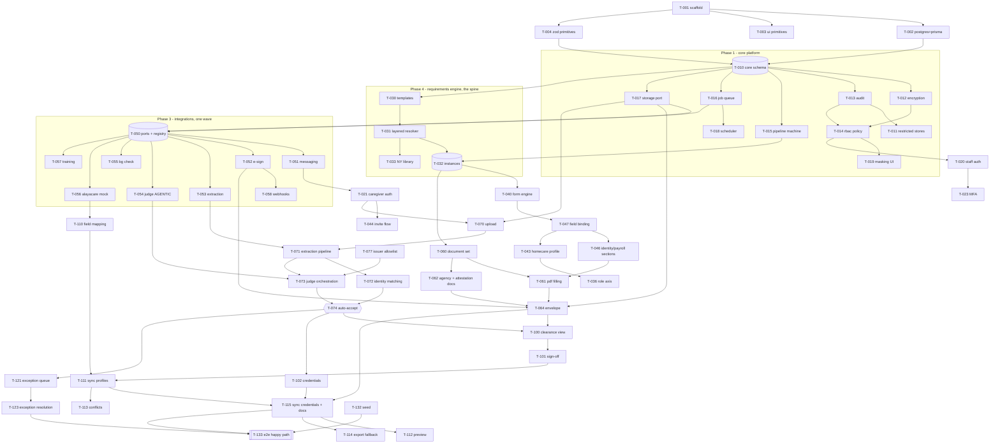

# Task DAG

**Revision 2** — 80 tasks, 16 dependency waves. `docs/dag/dag.json` is the machine-readable
source of truth; this file explains the shape of it. `docs/PROGRESS.md` is generated from it
— never edited.

Revision 1 (67 tasks) was reviewed against the PRD before any code was written; the review
and the fourteen tasks it added are in `docs/dag/REVIEW.md`. Read that before questioning an
edge here — it probably explains why.

```bash
node scripts/dag.mjs validate   # cycles, dangling deps, bad statuses
node scripts/dag.mjs ready      # what can be started right now, in parallel
node scripts/dag.mjs waves      # the full parallel schedule
node scripts/dag.mjs show T-074 # one task, its deps, and what it unblocks
node scripts/dag.mjs set T-001 done
```

## Shape of the graph

Abridged — every node is in `dag.json`; this shows the load-bearing edges.



## Why the graph is shaped this way

**T-010 and T-050 are the two hinges.** Almost everything descends from the core schema or
from the port registry. They are the only two tasks worth serialising around.

**The requirements engine (T-030 to T-032) gates five modules.** Intake asks only for fields a
requirement needs; the document set contains only documents a requirement needs; clearance is
a fold over instances; the sync writes credentials derived from them. Building intake first
would mean building it twice.

**T-017 exists so that no byte is written before there is a place to put it.** Generated PDFs,
signed PDFs, camera uploads, documents pushed to AlayaCare, and audited deletion are five
consumers across five waves. Without one owner in phase 1 they become five conventions and a
reconciliation in wave 14. The review that added it is in `REVIEW.md`.

**T-074 (auto-accept) is the narrowest waist.** It is the one place where extraction, identity
matching, the judge, and the requirement model meet, and six later tasks wait on it. Wave 10
is nearly empty for this reason. It is pure, small, and heavily tested.

**Integrations fan out wide (wave 5, 12 tasks).** Every port is independent of every other, so
all eight adapters can be built concurrently once the registry exists. T-050 pre-declares
every port slot and env var precisely so those twelve concurrent tasks do not collide on
`registry.ts` and `env.ts`.

**The tail (waves 12 to 15) is necessarily serial.** Sign-off must precede sync; profile sync
must precede credential sync; that must precede preview, the export fallback, and the
end-to-end test. No amount of parallelism removes that ordering — it is the product's actual
causality.

## Critical path

Computed, not asserted — the script derives it from the graph:

```
T-001 → T-002 → T-010 → T-016 → T-050 → T-051 → T-021 → T-070 → T-071
      → T-072 → T-074 → T-100 → T-101 → T-111 → T-115 → T-112
```

Sixteen tasks. Note what is *on* it: the messaging adapter, caregiver auth, and document
upload. `T-071` waits on upload (`T-070`), not on the extraction adapter (`T-053`) — the
adapter lands five waves earlier and has slack. Protect the chain above; everything else has
room.

The two agentic tasks (`T-054`, `T-073`) are deliberately *off* the critical path, so a
problem with the judge cannot stall the pipeline.

## The two agentic tasks

`T-054` (judge adapter) and `T-073` (judge orchestration) are the only tasks permitted to
involve an LLM at runtime, and both default to a deterministic mock. See
`docs/context/AGENTIC-TASKS.md` for the justification and the rejected alternatives.

## Deliberately deferred

Not in this graph, per the PRD's non-goals: scheduling, recruiting, training content,
continuous post-hire compliance monitoring, cross-agency records, states other than New York,
languages other than English, payroll processing, native apps.

`T-090` (training hours) and `T-114` (AlayaCare export fallback) are the only P1 tasks;
everything else is P0. Both are scheduled last regardless of what the wave computation says.
